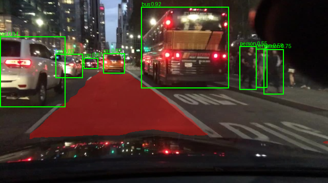
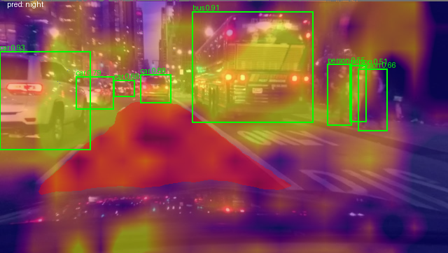
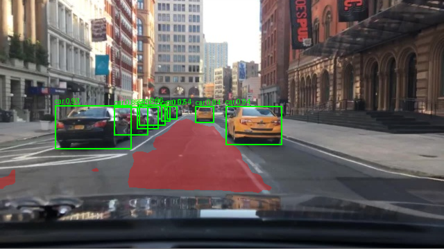
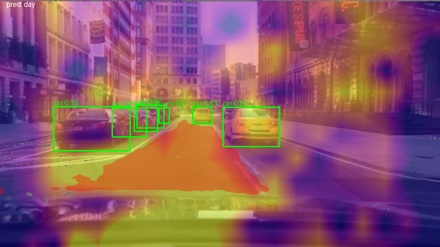
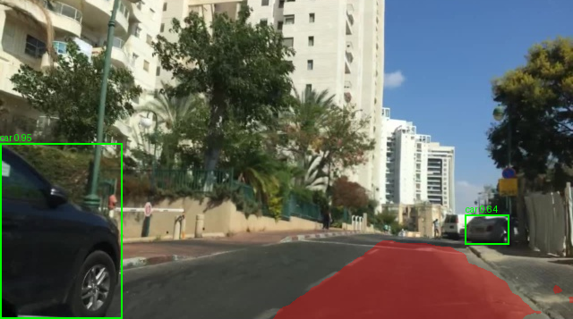
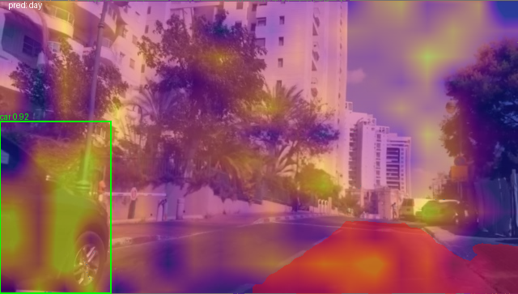

# Explainable-by-Design Perception for Autonomous Driving (BDD100K)

This repository contains our XAI autonomous-driving project built on a YOLOv8-based multi-task perception model with an explainability-by-design approach using CBAM (spatial attention).

## Tasks
- Object detection (5 classes): person, car, bike, bus, truck  
- Drivable-area segmentation (binary)
- Day/Night tagging (binary)

## Repository Structure
- `training/`  
  Training notebooks used to train the baseline and attention-based models.
- `evaluation/`  
  Test-set evaluation notebooks, perturbation test, and qualitative overlays.
- `models/`  
  Trained weight files (`.pt`) used by the evaluation notebooks.

## How to Reproduce Results
1. Download and prepare BDD100K locally using the same structure used during training (dataset is not included in this repo).
2. Place the trained weights in `models/`.
3. Run the evaluation notebooks in order:
   - `01_baseline_det_test.ipynb`
   - `02_baseline_det_seg_test.ipynb`
   - `03_tritask_cbam_test.ipynb`
   - `04_perturbation.ipynb`
   - `05_overlays.ipynb`
## Qualitative Examples (Report Figures)

**Scene 1 — Det+Seg (baseline) vs Tri-task + CBAM**

  
  

**Scene 2 — Det+Seg (baseline) vs Tri-task + CBAM**

  
  

**Scene 3 — Det+Seg (baseline) vs Tri-task + CBAM**

  
  

## Notes
- All experiments use input resolution **640×640**.

